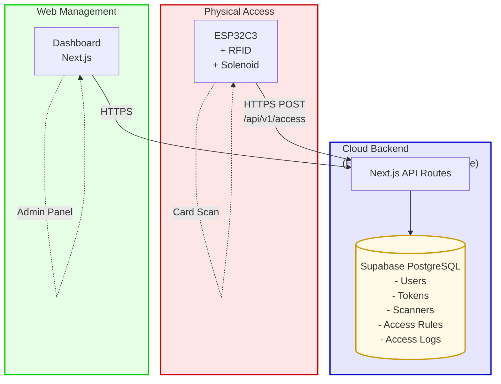
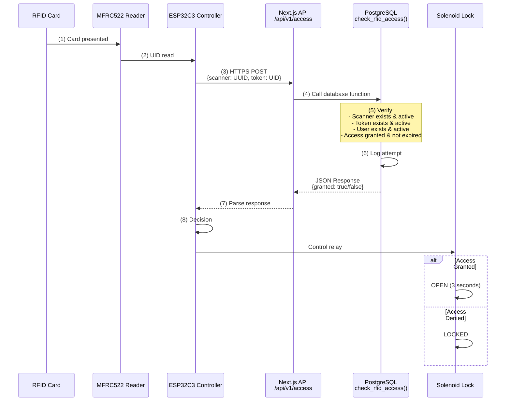
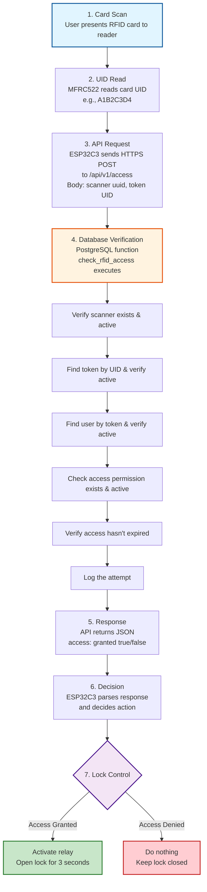
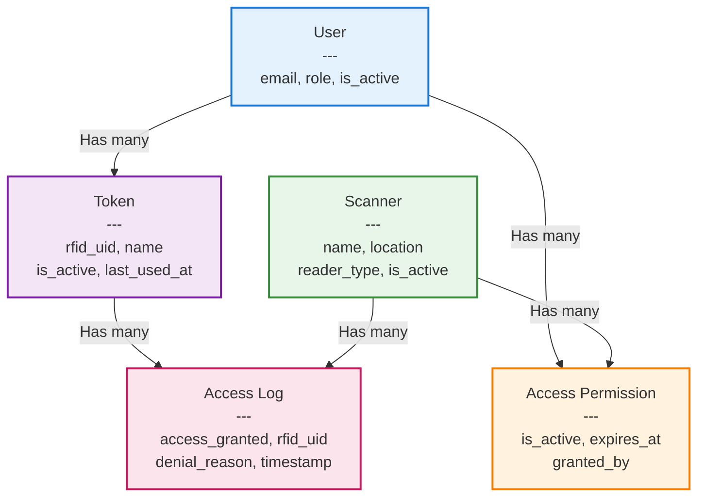

# 🔐 RFID Access Control System

[](https://nextjs.org/)
[](https://www.espressif.com/)
[](https://www.typescriptlang.org/)
[](https://supabase.com/)
[](LICENSE.md)

A complete, production-ready RFID-based access control system with cloud management. This project combines embedded hardware (ESP32C3 + RFID reader) with a modern web application to provide secure, scalable access management for doors, gates, and restricted areas.

---

## 📋 Table of Contents

- [Overview](#-overview)
- [System Architecture](#-system-architecture)
- [Features](#-features)
- [Components](#-components)
- [Quick Start](#-quick-start)
- [System Requirements](#-system-requirements)
- [Data Flow](#-data-flow)
- [Technology Stack](#-technology-stack)
- [Use Cases](#-use-cases)
- [Security](#-security)
- [Documentation](#-documentation)
- [Contributing](#-contributing)
- [License](#-license)

---

## 🎯 Overview

This RFID Access Control System provides a complete solution for managing physical access to buildings, rooms, or restricted areas. It consists of two main components working together:

1. **Hardware Backend** ([`arduino/`](arduino/)) - ESP32C3 microcontroller with RFID reader that controls door locks
2. **Web Application** ([`system/`](system/)) - Next.js management dashboard for users, tokens, and access permissions

The system uses secure HTTPS communication to verify access in real-time, with all data stored in a cloud PostgreSQL database.

### Key Highlights

- 🔒 **Secure** - HTTPS/SSL encrypted communication, role-based access control
- ☁️ **Cloud-Based** - No local server required, accessible from anywhere
- 📱 **Modern UI** - Responsive web dashboard with dark mode support
- 🚀 **Scalable** - Support for multiple scanners and unlimited users
- 🔧 **Easy Setup** - Comprehensive documentation and simple configuration
- 📊 **Full Logging** - Complete audit trail of all access attempts
- ⚡ **Real-time** - Instant access verification and updates

---

## 🏗 System Architecture

### High-Level Architecture



### Component Interaction



---

## ✨ Features

### Hardware Features (ESP32C3)

- ✅ **RFID Card Reading** - Support for 13.56MHz MIFARE cards
- ✅ **WiFi Connectivity** - Built-in 2.4GHz WiFi, no Ethernet shield needed
- ✅ **HTTPS Communication** - Secure SSL/TLS encrypted API requests
- ✅ **Electronic Lock Control** - Relay-based solenoid/magnetic lock control
- ✅ **Card Debouncing** - Prevents duplicate reads (2-second cooldown)
- ✅ **Status Feedback** - Serial monitor output for debugging
- ✅ **Auto-Reconnection** - Automatic WiFi recovery
- ✅ **Low Power** - Efficient RISC-V architecture

### Web Application Features

- ✅ **User Management** - Create and manage user accounts with roles
- ✅ **Token Management** - Register RFID cards and assign to users
- ✅ **Scanner Management** - Configure multiple access points
- ✅ **Access Control** - Grant/revoke permissions with expiration dates
- ✅ **Access Logs** - Complete audit trail with filtering and search
- ✅ **Dashboard** - Real-time statistics and activity charts
- ✅ **Role-Based Access** - Root, Admin, and User permission levels
- ✅ **CSV Export** - Export logs for external analysis
- ✅ **Dark Mode** - System-wide theme support
- ✅ **Responsive Design** - Mobile, tablet, and desktop optimized
- ✅ **Real-time Updates** - Live data synchronization

---

## 📦 Components

### 1. Arduino Backend ([`arduino/`](arduino/))

**Purpose:** Embedded firmware for ESP32C3 microcontroller that reads RFID cards and controls door locks.

**Key Files:**

- [`Arduino.ino`](arduino/Arduino.ino) - Main firmware code
- [`README.md`](arduino/README.md) - Hardware setup and configuration guide

**Hardware:**

- XIAO ESP32C3 microcontroller
- MFRC522 RFID reader (13.56MHz)
- Relay module
- Solenoid/magnetic lock
- Power supply

**Responsibilities:**

- Read RFID card UIDs
- Send HTTPS requests to API
- Parse access verification responses
- Control door lock relay
- Provide serial debugging output

[📖 View Arduino Documentation](arduino/README.md)

### 2. Web Application ([`system/`](system/))

**Purpose:** Cloud-based management dashboard and API for access control administration.

**Key Directories:**

- [`src/app/`](system/src/app/) - Next.js pages and API routes
- [`src/components/`](system/src/components/) - React UI components
- [`supabase/migrations/`](system/supabase/migrations/) - Database schema

**Technology:**

- Next.js 16 (React 19)
- TypeScript
- Supabase (PostgreSQL)
- Tailwind CSS + shadcn/ui
- Vercel hosting

**Responsibilities:**

- User authentication and authorization
- CRUD operations for users, tokens, scanners
- Access permission management
- Real-time access verification API
- Access logging and reporting
- Administrative dashboard

[📖 View System Documentation](system/README.md)

---

## 🚀 Quick Start

### Prerequisites

- **Hardware:**

  - XIAO ESP32C3 board
  - MFRC522 RFID reader
  - Relay module
  - Solenoid lock
  - RFID cards/tags

- **Software:**

  - Arduino IDE 2.0+
  - Node.js 18+
  - Git

- **Accounts:**
  - Supabase account (free tier works)
  - Vercel account (optional, for deployment)

### Step 1: Set Up Web Application

```bash
# Clone repository
git clone https://github.com/Guliveer/rfid-access-manager.git
cd rfid-access-manager/system

# Install dependencies
npm install

# Configure environment
cp .env.example .env.local
# Edit .env.local with your Supabase credentials

# Run database migrations
# (See system/README.md for detailed instructions)

# Start development server
npm run dev
```

Access the dashboard at [http://localhost:3000](http://localhost:3000)

### Step 2: Configure System

1. **Create root user** in Supabase
2. **Login** to dashboard
3. **Add scanner** - Copy the generated UUID
4. **Add users** - Create user accounts
5. **Register tokens** - Add RFID card UIDs
6. **Grant access** - Assign permissions

### Step 3: Set Up Hardware

```bash
# Open Arduino IDE
# Install ESP32 board support
# Install MFRC522 library

# Open arduino/Arduino.ino
# Configure:
# - WiFi credentials
# - Scanner UUID (from step 2)
# - API endpoint

# Upload to ESP32C3
```

### Step 4: Test

1. **Open Serial Monitor** (9600 baud)
2. **Scan RFID card** on reader
3. **Verify access** in serial output
4. **Check logs** in web dashboard

[📖 Detailed Setup Guide](system/README.md#-getting-started)

---

## 💻 System Requirements

### Hardware Requirements

| Component           | Minimum            | Recommended                  |
| ------------------- | ------------------ | ---------------------------- |
| **Microcontroller** | ESP32C3            | XIAO ESP32C3                 |
| **RFID Reader**     | MFRC522 (13.56MHz) | MFRC522 with antenna         |
| **Relay**           | 5V single channel  | 5V optocoupler isolated      |
| **Lock**            | 12V solenoid       | 12V/24V electromagnetic lock |
| **Power Supply**    | 5V 2A + 12V 1A     | 5V 3A + 12V 2A               |

### Software Requirements

| Software          | Version | Purpose                 |
| ----------------- | ------- | ----------------------- |
| **Arduino IDE**   | 2.0+    | Firmware development    |
| **Node.js**       | 18+     | Web application runtime |
| **npm/yarn/pnpm** | Latest  | Package management      |
| **Git**           | Latest  | Version control         |

### Network Requirements

| Requirement   | Specification                |
| ------------- | ---------------------------- |
| **WiFi**      | 2.4 GHz (ESP32C3 limitation) |
| **Internet**  | Stable connection required   |
| **Bandwidth** | ~1 KB per access check       |
| **Latency**   | <5 seconds recommended       |
| **Ports**     | Outbound 443 (HTTPS)         |

### Cloud Services

| Service      | Tier         | Purpose                    |
| ------------ | ------------ | -------------------------- |
| **Supabase** | Free or Pro  | PostgreSQL database + Auth |
| **Vercel**   | Hobby or Pro | Web application hosting    |

**Note:** Free tiers are sufficient for small deployments (1-5 scanners, <100 users).

---

## 🔄 Data Flow

### Access Verification Flow



### Data Entities



---

## 🛠 Technology Stack

### Embedded System

| Technology            | Purpose                          |
| --------------------- | -------------------------------- |
| **ESP32-C3**          | RISC-V microcontroller with WiFi |
| **Arduino Framework** | Firmware development environment |
| **MFRC522 Library**   | RFID reader communication        |
| **WiFiClientSecure**  | HTTPS/SSL client                 |
| **SPI**               | RFID reader interface            |

### Web Application

| Layer          | Technology                       | Purpose               |
| -------------- | -------------------------------- | --------------------- |
| **Frontend**   | Next.js 16, React 19, TypeScript | UI framework          |
| **Styling**    | Tailwind CSS, shadcn/ui          | Component library     |
| **Backend**    | Next.js API Routes               | RESTful API           |
| **Database**   | Supabase (PostgreSQL)            | Data storage          |
| **Auth**       | Supabase Auth                    | User authentication   |
| **Hosting**    | Vercel                           | Serverless deployment |
| **Validation** | Zod                              | Schema validation     |
| **Forms**      | React Hook Form                  | Form management       |
| **Charts**     | Recharts                         | Data visualization    |

### Infrastructure

| Service      | Purpose                                                      |
| ------------ | ------------------------------------------------------------ |
| **Vercel**   | Web application hosting, serverless functions, cron jobs     |
| **Supabase** | PostgreSQL database, authentication, real-time subscriptions |
| **GitHub**   | Version control, CI/CD integration                           |

---

## 💡 Use Cases

### 1. Office Building Access

**Scenario:** Manage employee access to office floors and restricted areas.

**Setup:**

- Multiple scanners at different entry points
- Employee RFID badges
- Time-limited access for contractors
- Audit logs for compliance

**Benefits:**

- Centralized access management
- Instant badge activation/deactivation
- Detailed access history
- No physical key management

### 2. Residential Complex

**Scenario:** Control access to building entrances, parking, and amenities.

**Setup:**

- Scanners at main entrance, parking gate, gym, pool
- Resident RFID cards/fobs
- Visitor temporary access
- Different access levels per area

**Benefits:**

- 24/7 automated access
- Visitor management
- No lost key issues
- Usage statistics

### 3. Laboratory/Research Facility

**Scenario:** Secure access to labs with hazardous materials or sensitive equipment.

**Setup:**

- High-security scanners
- Researcher credentials
- Time-based access schedules
- Comprehensive audit trail

**Benefits:**

- Compliance with safety regulations
- Access tracking for accountability
- Emergency access control
- Integration with safety systems

### 4. Co-working Space

**Scenario:** Flexible access for members with different subscription levels.

**Setup:**

- Entry scanner + meeting room scanners
- Member RFID cards
- Tiered access (basic, premium, executive)
- Expiration-based memberships

**Benefits:**

- Automated membership management
- Flexible access tiers
- Usage analytics
- Scalable for growth

### 5. Educational Institution

**Scenario:** Control access to classrooms, labs, and facilities.

**Setup:**

- Scanners at building entrances and special rooms
- Student/staff ID cards
- Schedule-based access
- Department-specific permissions

**Benefits:**

- Campus security
- After-hours access control
- Resource usage tracking
- Integration with student systems

---

## 🔒 Security

### Communication Security

- **HTTPS/TLS Encryption** - All API communication is encrypted
- **Certificate Verification** - Optional certificate pinning for production
- **Secure WiFi** - WPA2/WPA3 recommended
- **API Authentication** - Cron jobs protected with secret tokens

### Access Control

- **Role-Based Access Control (RBAC)** - Three-tier permission system
- **Row-Level Security (RLS)** - Database-level access policies
- **Session Management** - Secure authentication with Supabase Auth
- **Password Hashing** - bcrypt encryption for credentials

### Data Security

- **Database Encryption** - Data encrypted at rest in Supabase
- **Environment Variables** - Sensitive credentials in environment
- **Audit Logging** - Complete access attempt history
- **Token Validation** - Multi-step verification process

### Physical Security

- **Tamper-Proof Enclosures** - Protect hardware from physical access
- **Fail-Secure Locks** - Locks remain closed on power loss
- **Backup Power** - UPS for continuous operation
- **Network Isolation** - Separate IoT network recommended

### Best Practices

1. ✅ Use strong WiFi passwords (16+ characters)
2. ✅ Rotate CRON_SECRET regularly
3. ✅ Enable certificate pinning in production
4. ✅ Implement physical security for hardware
5. ✅ Regular security audits of access logs
6. ✅ Disable unused tokens immediately
7. ✅ Use time-limited access for temporary users
8. ✅ Keep firmware and software updated

---

## 📚 Documentation

### Component Documentation

- **[Arduino Backend Documentation](arduino/README.md)**

  - Hardware wiring diagrams
  - Firmware configuration
  - Troubleshooting guide
  - API integration details
  - Technical specifications

- **[Web Application Documentation](system/README.md)**
  - Installation guide
  - Database schema
  - API reference
  - Deployment instructions
  - Development guide

### Quick Links

| Topic                     | Link                                                                      |
| ------------------------- | ------------------------------------------------------------------------- |
| **Hardware Setup**        | [arduino/README.md#hardware-wiring](arduino/README.md#-hardware-wiring)   |
| **Software Installation** | [system/README.md#getting-started](system/README.md#-getting-started)     |
| **API Documentation**     | [system/README.md#api-documentation](system/README.md#-api-documentation) |
| **Database Schema**       | [system/README.md#database-schema](system/README.md#-database-schema)     |
| **Troubleshooting**       | [arduino/README.md#troubleshooting](arduino/README.md#-troubleshooting)   |
| **Deployment**            | [system/README.md#deployment](system/README.md#-deployment)               |

---

## 👨‍💻 Author

**Oliwer Pawelski** - [@Guliveer](https://github.com/Guliveer)

**Dawid Naraziński** - [@DawSkii](https://github.com/DawSkii)

---

## 🌟 Star History

If you find this project useful, please consider giving it a star on GitHub! ⭐

---

<p align="center">
  <strong>Built with ❤️ for secure, modern access control</strong>
</p>

<p align="center">
  <a href="https://github.com/Guliveer/rfid-access-manager">View on GitHub</a> •
  <a href="arduino/README.md">Arduino Docs</a> •
  <a href="system/README.md">System Docs</a>
</p>
