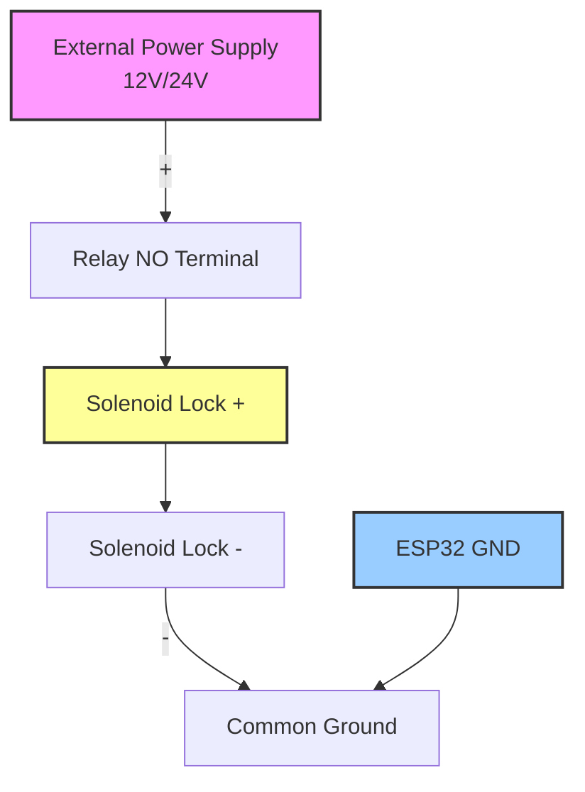
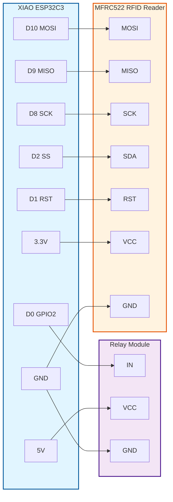
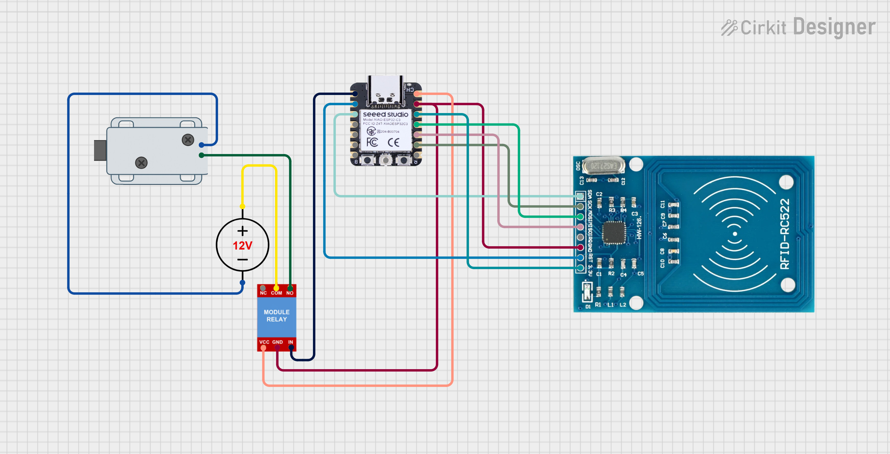

# RFID Access Control System - ESP32C3 Backend

[](https://www.espressif.com/)
[](https://www.arduino.cc/)
[](https://en.wikipedia.org/wiki/HTTPS)

Embedded backend for RFID-based access control system using XIAO ESP32C3 microcontroller with secure HTTPS communication. This component reads RFID cards, communicates with the cloud API, and controls physical door locks.

---

## 📋 Table of Contents

- [Features](#-features)
- [Hardware Requirements](#-hardware-requirements)
- [Software Requirements](#-software-requirements)
- [Installation](#-installation)
- [Hardware Wiring](#-hardware-wiring)
- [Configuration](#️-configuration)
- [Usage](#-usage)
- [Code Structure](#-code-structure)
- [API Integration](#-api-integration)
- [Security](#-security)
- [Troubleshooting](#-troubleshooting)
- [Technical Specifications](#-technical-specifications)

---

## 🎯 Features

- ✅ **Secure HTTPS Communication** - SSL/TLS encrypted API requests (port 443)
- ✅ **Built-in WiFi** - No external Ethernet shield required
- ✅ **RFID Card Reading** - Support for 13.56MHz RFID cards/tags (MFRC522)
- ✅ **Electronic Lock Control** - Solenoid/relay-based door lock management
- ✅ **Card Debouncing** - 2-second cooldown prevents duplicate reads
- ✅ **Real-time Logging** - Serial monitor output for debugging
- ✅ **Automatic Reconnection** - WiFi connection recovery
- ✅ **Low Power Consumption** - Efficient ESP32-C3 RISC-V architecture

---

## 🔧 Hardware Requirements

### Required Components

| Component         | Description                    | Specifications                     | Quantity |
| ----------------- | ------------------------------ | ---------------------------------- | -------- |
| **XIAO ESP32C3**  | Main microcontroller with WiFi | ESP32-C3 RISC-V, 160MHz, 4MB Flash | 1        |
| **MFRC522**       | RFID reader module             | 13.56MHz, SPI interface            | 1        |
| **Relay Module**  | Controls high-power solenoid   | 5V/12V, optocoupler isolated       | 1        |
| **Solenoid Lock** | Electronic door lock           | 12V or 24V DC                      | 1        |
| **Power Supply**  | External power for solenoid    | 12V/24V, 1-2A minimum              | 1        |
| **Breadboard**    | Prototyping connections        | Standard size                      | 1        |
| **Jumper Wires**  | Male-to-male, male-to-female   | Various lengths                    | ~15      |

### Optional Components

- **LED Indicators** - Visual feedback for access status
- **Buzzer** - Audio feedback for card scans
- **Enclosure** - Protective housing for the system
- **PCB** - Custom board for permanent installation

---

## 💻 Software Requirements

### Arduino IDE Setup

| Software                | Version | Purpose                   |
| ----------------------- | ------- | ------------------------- |
| **Arduino IDE**         | 2.0+    | Development environment   |
| **ESP32 Board Support** | Latest  | Espressif ESP32 platform  |
| **MFRC522 Library**     | Latest  | RFID reader communication |

### Required Libraries

All libraries are available through Arduino Library Manager:

- **WiFi** (built-in) - WiFi connectivity
- **WiFiClientSecure** (built-in) - HTTPS/SSL support
- **SPI** (built-in) - SPI communication protocol
- **MFRC522** by GithubCommunity - RFID reader driver

---

## 📦 Installation

### Step 1: Install Arduino IDE

Download and install Arduino IDE 2.0 or later from [arduino.cc](https://www.arduino.cc/en/software)

### Step 2: Add ESP32 Board Support

1. Open Arduino IDE
2. Go to **File → Preferences**
3. Add this URL to **Additional Boards Manager URLs**:
   ```
   https://raw.githubusercontent.com/espressif/arduino-esp32/gh-pages/package_esp32_index.json
   ```
4. Go to **Tools → Board → Boards Manager**
5. Search for `esp32`
6. Install **esp32 by Espressif Systems**

### Step 3: Install MFRC522 Library

1. Go to **Sketch → Include Library → Manage Libraries**
2. Search for `MFRC522`
3. Install **MFRC522 by GithubCommunity**

### Step 4: Select Board

1. Go to **Tools → Board → ESP32 Arduino**
2. Select **XIAO_ESP32C3**
3. Select the correct **Port** (usually `/dev/ttyUSB0` or `COM3`)

---

## 🔌 Hardware Wiring

### MFRC522 RFID Reader → XIAO ESP32C3

| MFRC522 Pin  | ESP32C3 Pin | GPIO Number | Function                |
| ------------ | ----------- | ----------- | ----------------------- |
| **SDA (SS)** | **D2**      | GPIO4       | SPI Chip Select         |
| **RST**      | **D1**      | GPIO3       | Reset                   |
| **SCK**      | **D8**      | GPIO8       | SPI Clock               |
| **MISO**     | **D9**      | GPIO9       | SPI Master In Slave Out |
| **MOSI**     | **D10**     | GPIO10      | SPI Master Out Slave In |
| **VCC**      | **3.3V**    | -           | Power Supply            |
| **GND**      | **GND**     | -           | Ground                  |

⚠️ **CRITICAL WARNING**: MFRC522 operates at **3.3V ONLY**! Connecting to 5V will permanently damage the module.

### Relay Module → XIAO ESP32C3

| Relay Pin | ESP32C3 Pin | GPIO Number | Function       |
| --------- | ----------- | ----------- | -------------- |
| **IN**    | **D0**      | GPIO2       | Control Signal |
| **VCC**   | **5V/VUSB** | -           | Power Supply   |
| **GND**   | **GND**     | -           | Ground         |

### Solenoid Lock Wiring



**Important Notes:**

- **Never** connect solenoid directly to ESP32 pins (insufficient current)
- Use relay's **NO (Normally Open)** terminal for fail-secure operation
- Ensure common ground between ESP32 and external power supply
- Add flyback diode across solenoid coil to protect relay contacts

### Complete Wiring Diagram



### Circuit Diagram

For a complete visual reference of the circuit, see the image below:



_Complete circuit schematic showing ESP32C3, MFRC522 RFID reader, relay module, and solenoid lock connections._

---

## ⚙️ Configuration

### 1. Open Arduino.ino

Navigate to the [`arduino/Arduino.ino`](Arduino.ino:1) file in Arduino IDE.

### 2. Configure WiFi Credentials

Update lines 6-7 with your WiFi network details:

```cpp
const char* ssid = "YOUR_WIFI_SSID";
const char* password = "YOUR_WIFI_PASSWORD";
```

**Requirements:**

- WiFi must be **2.4 GHz** (ESP32C3 does not support 5 GHz)
- WPA2 or WPA3 security recommended
- Stable internet connection required

### 3. Configure Scanner ID

Update line 17 with your scanner UUID from the management panel:

```cpp
const char* scannerId = "your-scanner-uuid-here";
```

**How to get Scanner ID:**

1. Log in to the web management panel
2. Navigate to **Dashboard → Scanners**
3. Copy the UUID of your scanner
4. Paste it into the code

### 4. Optional: Adjust Timing Parameters

```cpp
// Card debouncing time (milliseconds)
unsigned long debounceTime = 2000;  // Line 73

// API timeout (milliseconds)
unsigned long apiTimeout = 10000;   // Line 132

// Door open duration (milliseconds)
int doorOpenTime = 3000;            // Line 165
```

### 5. Upload Code

1. Connect ESP32C3 via USB cable
2. Click **Upload** button (or press `Ctrl+U`)
3. Wait for compilation and upload to complete
4. Open **Serial Monitor** (`Ctrl+Shift+M`) at **9600 baud**

---

## 🚀 Usage

### Initial Startup

After uploading the code, open the Serial Monitor to view system status:

```
=== RFID Access Control - HTTPS ===

Laczenie z WiFi..... OK
IP: 192.168.1.100

System gotowy - przyloz karte RFID
```

### Successful Access

When a valid RFID card is scanned:

```
[KARTA] Token: A1B2C3D4
Sprawdzanie dostepu... OK
[DOSTEP] Przyznany!
Otwieranie drzwi...
Zamknieto
```

**Process:**

1. Card detected and UID read
2. HTTPS request sent to API
3. Access verified and granted
4. Solenoid activated for 3 seconds
5. Door automatically locks

### Access Denied

When an invalid or unauthorized card is scanned:

```
[KARTA] Token: DEADBEEF
Sprawdzanie dostepu... ODMOWA
[DOSTEP] Odmowiony!
```

**Common Denial Reasons:**

- Token not registered in system
- User account disabled
- Access permission expired
- Scanner disabled
- Token disabled

---

## 📁 Code Structure

### File Organization

```
arduino/
├── Arduino.ino              # Main program file
├── README.md                # This documentation
└── ArduinoProject.*         # IDE project files
```

### Main Functions

#### [`setup()`](Arduino.ino:24)

Initializes the system on startup.

```cpp
void setup() {
    // Initialize serial communication
    // Configure GPIO pins
    // Initialize SPI and MFRC522
    // Connect to WiFi
    // Configure SSL client
}
```

**Responsibilities:**

- Serial communication at 9600 baud
- Solenoid pin configuration (OUTPUT mode)
- SPI bus initialization
- MFRC522 RFID reader initialization
- WiFi connection establishment
- SSL/TLS configuration

#### [`loop()`](Arduino.ino:59)

Main program loop, continuously checks for RFID cards.

```cpp
void loop() {
    // Check for new card
    // Read card UID
    // Apply debouncing
    // Verify access via API
    // Control door lock
}
```

**Responsibilities:**

- Detect new RFID cards
- Read card UID
- Implement 2-second debouncing
- Call access verification
- Trigger door opening on success

#### [`getCardID(char* buffer)`](Arduino.ino:91)

Reads RFID card UID and converts to hexadecimal string.

```cpp
void getCardID(char* buffer) {
    // Read UID bytes from MFRC522
    // Convert to hex string format
    // Store in buffer
}
```

**Parameters:**

- `buffer` - Character array to store UID (minimum 20 bytes)

**Output Format:** `"A1B2C3D4"` (uppercase hex, no separators)

#### [`checkAccess(char* cardID)`](Arduino.ino:101)

Verifies card access permission via HTTPS API.

```cpp
bool checkAccess(char* cardID) {
    // Check WiFi connection
    // Establish HTTPS connection
    // Send POST request with JSON body
    // Parse response
    // Return access decision
}
```

**Parameters:**

- `cardID` - RFID UID string

**Returns:**

- `true` - Access granted
- `false` - Access denied or error

**Process:**

1. Verify WiFi connectivity
2. Connect to API server via HTTPS (port 443)
3. Send POST request with scanner ID and token
4. Wait for response (10-second timeout)
5. Parse JSON response for `"granted":true`
6. Close connection and return result

#### [`openDoor()`](Arduino.ino:162)

Activates solenoid lock to open door.

```cpp
void openDoor() {
    // Activate solenoid (HIGH)
    // Wait 3 seconds
    // Deactivate solenoid (LOW)
}
```

**Behavior:**

- Sets GPIO2 HIGH (relay closes, solenoid energized)
- Maintains state for 3000ms
- Sets GPIO2 LOW (relay opens, solenoid de-energized)

---

## 📡 API Integration

### Endpoint Details

**URL:** `https://rfid-access-manager.vercel.app/api/v1/access`

**Method:** `POST`

**Content-Type:** `application/json`

### Request Format

```json
{
  "scanner": "7f3eeb72-5ca2-4e19-843c-dbedccaa3f00",
  "token": "A1B2C3D4"
}
```

| Field     | Type          | Required | Description                |
| --------- | ------------- | -------- | -------------------------- |
| `scanner` | string (UUID) | ✅ Yes   | Scanner device identifier  |
| `token`   | string        | ✅ Yes   | RFID card UID (hex format) |

### Response Format

#### Success Response (Access Granted)

```json
{
  "access": {
    "granted": true,
    "until": "2024-12-31T23:59:59.000Z",
    "denyReason": null
  },
  "data": {
    "rfid_uid": "A1B2C3D4",
    "user_id": "user-uuid",
    "scanner_id": "scanner-uuid"
  },
  "timestamp": "2024-01-15T10:30:00.000Z"
}
```

#### Error Response (Access Denied)

```json
{
  "access": {
    "granted": false,
    "until": null,
    "denyReason": "Token not found"
  },
  "error": "TOKEN_NOT_FOUND",
  "timestamp": "2024-01-15T10:30:00.000Z"
}
```

### HTTP Status Codes

| Code | Meaning        | Description                     |
| ---- | -------------- | ------------------------------- |
| 200  | OK             | Request processed successfully  |
| 400  | Bad Request    | Missing required fields         |
| 403  | Forbidden      | Access denied (various reasons) |
| 404  | Not Found      | Token/Scanner/User not found    |
| 500  | Internal Error | Server-side error               |

### Error Codes

| Error Code          | Description                 | Solution                           |
| ------------------- | --------------------------- | ---------------------------------- |
| `TOKEN_NOT_FOUND`   | RFID token not registered   | Register token in management panel |
| `TOKEN_DISABLED`    | Token is deactivated        | Enable token in management panel   |
| `USER_NOT_FOUND`    | User account not found      | Check user database                |
| `USER_DISABLED`     | User account deactivated    | Enable user account                |
| `SCANNER_NOT_FOUND` | Scanner not registered      | Register scanner in system         |
| `SCANNER_DISABLED`  | Scanner is deactivated      | Enable scanner                     |
| `NO_ACCESS`         | No permission granted       | Grant access in management panel   |
| `ACCESS_DISABLED`   | Access rule deactivated     | Enable access rule                 |
| `ACCESS_EXPIRED`    | Time-limited access expired | Extend access expiration date      |

### Arduino Implementation

The ESP32C3 code implements a simple HTTP parser:

```cpp
// Parse response line by line
while (client.available()) {
    String line = client.readStringUntil('\n');

    // Skip headers, process body
    if (inBody && line.indexOf("\"granted\":true") > -1) {
        granted = true;
    }
}
```

**Note:** This is a simplified parser. For production use, consider using ArduinoJson library for robust JSON parsing.

---

## 🔒 Security

### HTTPS/SSL Configuration

The system uses SSL/TLS encryption for all API communication:

```cpp
WiFiClientSecure client;
client.setInsecure();  // Skip certificate verification
```

#### Current Security Level

**Mode:** `setInsecure()`

- ✅ Encrypted communication (prevents eavesdropping)
- ❌ No certificate verification (vulnerable to MITM attacks)

#### Production Security (Recommended)

For enhanced security, implement certificate pinning:

```cpp
// Add root CA certificate
const char* root_ca = \
"-----BEGIN CERTIFICATE-----\n" \
"MIIDdzCCAl+gAwIBAgIEAgAAuTANBgkqhkiG9w0BAQUFADBaMQswCQYDVQQGEwJJ\n" \
"... (certificate content) ...\n" \
"-----END CERTIFICATE-----\n";

// Use certificate verification
client.setCACert(root_ca);
```

**Benefits:**

- ✅ Prevents man-in-the-middle attacks
- ✅ Verifies server authenticity
- ✅ Industry-standard security

**How to get certificate:**

```bash
openssl s_client -showcerts -connect rfid-access-manager.vercel.app:443 < /dev/null
```

### WiFi Security

**Recommendations:**

- Use WPA2 or WPA3 encryption
- Strong WiFi password (16+ characters)
- Separate IoT network (VLAN isolation)
- Regular password rotation

### Physical Security

- Secure ESP32C3 in tamper-proof enclosure
- Hide wiring inside walls/conduits
- Use security screws for enclosure
- Install in access-controlled areas

---

## 🐛 Troubleshooting

### RFID Reader Issues

#### Problem: Cards not detected

**Symptoms:**

- No serial output when card is presented
- "System gotowy" message but no card reads

**Solutions:**

1. ✅ Verify MFRC522 is powered at **3.3V** (NOT 5V!)
2. ✅ Check SPI wiring (D8/SCK, D9/MISO, D10/MOSI)
3. ✅ Verify RST pin connected to D1 (GPIO3)
4. ✅ Verify SDA/SS pin connected to D2 (GPIO4)
5. ✅ Hold card closer to reader (1-3 cm optimal distance)
6. ✅ Try different card (some cards may be incompatible)
7. ✅ Check for loose connections on breadboard

**Test Code:**

```cpp
// Add to loop() for debugging
if (mfrc522.PICC_IsNewCardPresent()) {
    Serial.println("Card detected!");
}
```

#### Problem: Intermittent card reads

**Solutions:**

- Improve power supply stability (use capacitor on VCC)
- Shorten SPI wires (keep under 10cm)
- Add pull-up resistors on SPI lines (4.7kΩ)
- Check for electromagnetic interference

### WiFi Connection Issues

#### Problem: Cannot connect to WiFi

**Symptoms:**

```
Laczenie z WiFi............... BLAD!
```

**Solutions:**

1. ✅ Verify SSID and password are correct
2. ✅ Ensure WiFi is **2.4 GHz** (ESP32C3 doesn't support 5 GHz)
3. ✅ Check WiFi signal strength (move closer to router)
4. ✅ Verify router has DHCP enabled
5. ✅ Check for MAC address filtering on router
6. ✅ Try different WiFi channel (avoid congestion)
7. ✅ Restart router

**Debug Code:**

```cpp
Serial.print("WiFi Status: ");
Serial.println(WiFi.status());
// 0 = WL_IDLE_STATUS
// 3 = WL_CONNECTED
// 4 = WL_CONNECT_FAILED
// 6 = WL_DISCONNECTED
```

#### Problem: WiFi disconnects randomly

**Solutions:**

- Improve WiFi signal strength
- Add reconnection logic in loop()
- Use static IP instead of DHCP
- Check for power supply issues

#### Problem: "Timeout!" error

**Solutions:**

- Increase timeout value (line 132): `if (millis() - timeout > 15000)`
- Check network latency
- Verify API server response time

#### Problem: Always returns "ODMOWA"

**Solutions:**

1. ✅ Verify scanner UUID is correct
2. ✅ Check token is registered in system
3. ✅ Verify user has access permission
4. ✅ Check all entities are enabled (token, user, scanner, access)
5. ✅ Review access logs in management panel

### Solenoid/Lock Issues

#### Problem: Solenoid doesn't activate

**Symptoms:**

- "Otwieranie drzwi..." message appears
- No clicking sound from relay
- Door doesn't unlock

**Solutions:**

1. ✅ Verify relay is powered (5V to VCC)
2. ✅ Check relay IN pin connected to D0 (GPIO2)
3. ✅ Test relay manually (connect IN to GND)
4. ✅ Verify solenoid has external power supply
5. ✅ Check relay LED indicator lights up
6. ✅ Measure voltage at solenoid terminals

**Test Code:**

```cpp
// Add to setup() for testing
digitalWrite(SOLENOID_PIN, HIGH);
delay(1000);
digitalWrite(SOLENOID_PIN, LOW);
```

#### Problem: Relay clicks but solenoid doesn't move

**Solutions:**

- Check external power supply voltage (12V/24V)
- Verify power supply current rating (1-2A minimum)
- Test solenoid directly with power supply
- Check for blown fuse in power circuit
- Verify common ground connection

### Serial Monitor Issues

#### Problem: Garbled text in Serial Monitor

**Solutions:**

- Set baud rate to **9600** in Serial Monitor
- Check USB cable quality
- Try different USB port
- Restart Arduino IDE

#### Problem: No output in Serial Monitor

**Solutions:**

- Verify correct COM port selected
- Check USB cable is data-capable (not charge-only)
- Press reset button on ESP32C3
- Re-upload code

---

## 📊 Technical Specifications

### XIAO ESP32C3 Specifications

| Feature               | Specification                 |
| --------------------- | ----------------------------- |
| **Processor**         | ESP32-C3 (RISC-V single-core) |
| **Clock Speed**       | 160 MHz                       |
| **Flash Memory**      | 4 MB                          |
| **SRAM**              | 400 KB                        |
| **WiFi**              | 802.11 b/g/n (2.4 GHz)        |
| **Bluetooth**         | Bluetooth 5 (LE)              |
| **GPIO Pins**         | 11 digital I/O                |
| **ADC**               | 6 channels, 12-bit            |
| **SPI**               | 1 interface                   |
| **I2C**               | 1 interface                   |
| **UART**              | 2 interfaces                  |
| **Operating Voltage** | 3.3V                          |
| **Input Voltage**     | 5V (USB)                      |
| **Dimensions**        | 21 × 17.5 mm                  |
| **Weight**            | ~1g                           |

### MFRC522 Specifications

| Feature               | Specification                           |
| --------------------- | --------------------------------------- |
| **Frequency**         | 13.56 MHz                               |
| **Protocol**          | ISO/IEC 14443 A/MIFARE                  |
| **Interface**         | SPI (up to 10 Mbps)                     |
| **Operating Voltage** | 3.3V                                    |
| **Current Draw**      | 13-26 mA                                |
| **Read Range**        | 0-60 mm (depends on antenna)            |
| **Supported Cards**   | MIFARE Classic, MIFARE Ultralight, NTAG |

### Memory Usage

| Resource           | Usage   | Percentage       |
| ------------------ | ------- | ---------------- |
| **Flash**          | ~350 KB | ~8.5% of 4 MB    |
| **SRAM (Static)**  | ~15 KB  | ~3.75% of 400 KB |
| **SRAM (Runtime)** | ~30 KB  | ~7.5% of 400 KB  |

### Timing Parameters

| Parameter            | Value    | Configurable      |
| -------------------- | -------- | ----------------- |
| **Card Debounce**    | 2000 ms  | ✅ Yes (line 73)  |
| **API Timeout**      | 10000 ms | ✅ Yes (line 132) |
| **Door Open Time**   | 3000 ms  | ✅ Yes (line 165) |
| **Serial Baud Rate** | 9600 bps | ✅ Yes (line 25)  |
| **WiFi Timeout**     | 15000 ms | ✅ Yes (line 40)  |

### Power Consumption

| State               | Current Draw | Power (3.3V) |
| ------------------- | ------------ | ------------ |
| **Idle**            | ~40 mA       | ~132 mW      |
| **WiFi Active**     | ~120 mA      | ~396 mW      |
| **RFID Reading**    | ~150 mA      | ~495 mW      |
| **Solenoid Active** | ~1500 mA\*   | ~18-36 W\*   |

\*Solenoid powered by external supply, not ESP32

### Network Requirements

| Parameter     | Requirement            |
| ------------- | ---------------------- |
| **WiFi Band** | 2.4 GHz only           |
| **Security**  | WPA2/WPA3              |
| **Internet**  | Required (HTTPS API)   |
| **Bandwidth** | ~1 KB per access check |
| **Latency**   | <5 seconds recommended |
| **Ports**     | Outbound 443 (HTTPS)   |

---

## 📚 Additional Resources

### Documentation

- [ESP32-C3 Datasheet](https://www.espressif.com/sites/default/files/documentation/esp32-c3_datasheet_en.pdf)
- [MFRC522 Datasheet](https://www.nxp.com/docs/en/data-sheet/MFRC522.pdf)
- [Arduino ESP32 Core Documentation](https://docs.espressif.com/projects/arduino-esp32/en/latest/)

### Tutorials

- [MFRC522 Library Examples](https://github.com/miguelbalboa/rfid)
- [ESP32 WiFi Configuration](https://randomnerdtutorials.com/esp32-useful-wi-fi-functions-arduino/)
- [ESP32 HTTPS Requests](https://randomnerdtutorials.com/esp32-https-requests/)

### Community

- [ESP32 Forum](https://www.esp32.com/)
- [Arduino Forum](https://forum.arduino.cc/)
- [GitHub Issues](https://github.com/Guliveer/rfid-access-manager/issues)

---
