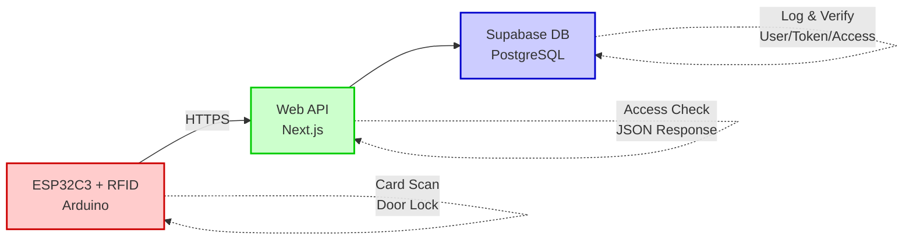
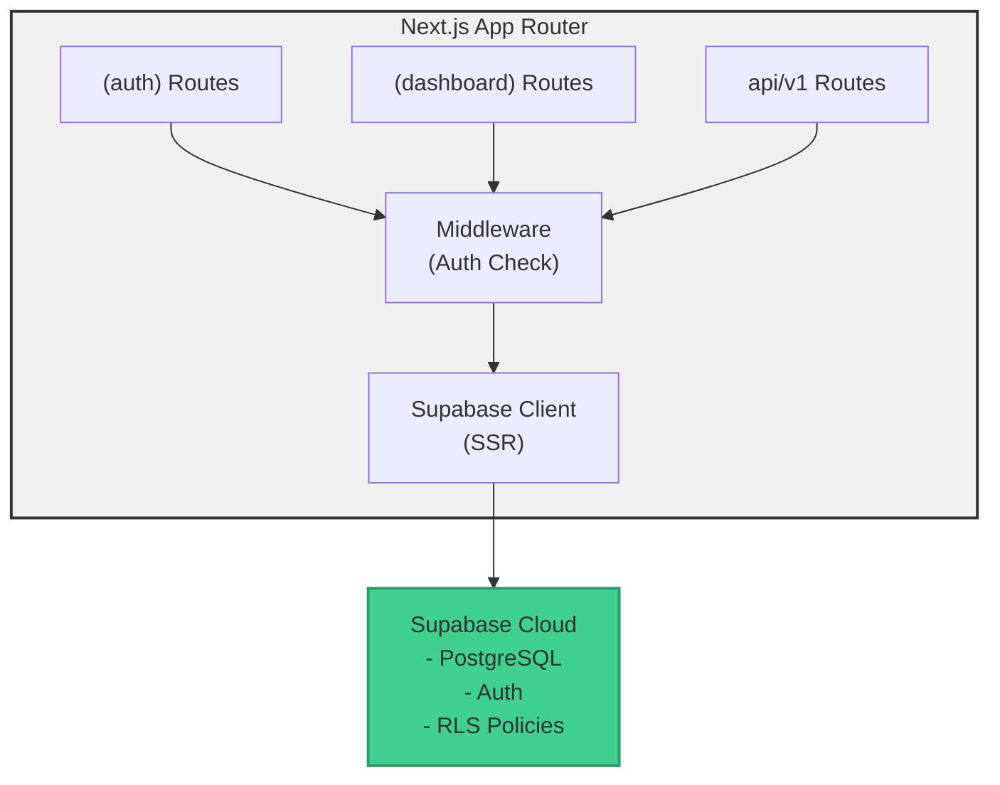
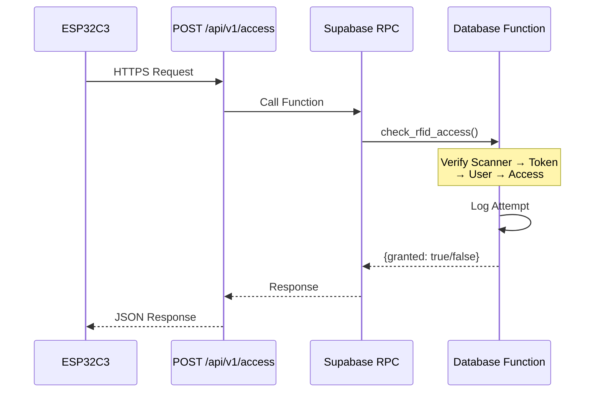
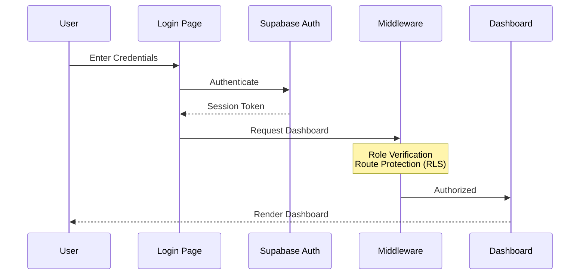
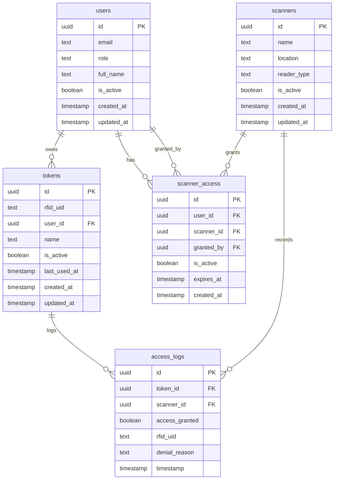
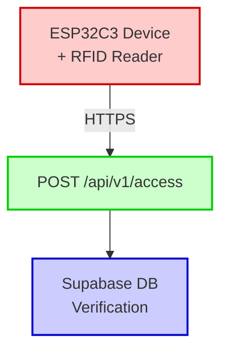

# 🔐 RFID Access Manager - Web Application

[](https://nextjs.org/)
[](https://www.typescriptlang.org/)
[](https://react.dev/)
[](https://supabase.com/)
[](https://vercel.com/)
[](LICENSE.md)

A comprehensive web-based management system for RFID access control. This application provides an administrative dashboard for managing users, RFID tokens, access permissions, scanners, and system logs. Designed for seamless integration with Arduino/ESP microcontrollers.

---

## 📋 Table of Contents

- [Features](#-features)
- [Tech Stack](#️-tech-stack)
- [Architecture](#-architecture)
- [Database Schema](#-database-schema)
- [Getting Started](#-getting-started)
- [Project Structure](#-project-structure)
- [Environment Variables](#-environment-variables)
- [API Documentation](#-api-documentation)
- [User Roles & Permissions](#-user-roles--permissions)
- [Development](#-development)
- [Deployment](#-deployment)
- [Hardware Integration](#-hardware-integration)
- [Troubleshooting](#-troubleshooting)

---

## ✨ Features

### Core Functionality

| Feature                   | Description                                                       | Access Level |
| ------------------------- | ----------------------------------------------------------------- | ------------ |
| 👥 **User Management**    | Create, read, update, delete users with role-based access control | Root, Admin  |
| 📡 **Scanner Management** | Configure RFID scanners/readers with location and type settings   | Root         |
| 🏷️ **Token Management**   | Register and manage RFID cards/fobs, assign to users              | Root, Admin  |
| 🔒 **Access Control**     | Grant/revoke access permissions with optional expiration dates    | Root, Admin  |
| 📊 **Access Logs**        | Complete history of all access attempts with filtering and search | Root, Admin  |
| 📈 **Dashboard**          | Real-time statistics, charts, and recent activity overview        | Root, Admin  |
| 🔐 **Authentication**     | Secure login with Supabase Auth and role-based routing            | All          |
| 🌓 **Dark Mode**          | System-wide theme support with user preference persistence        | All          |
| 📤 **CSV Export**         | Export access logs for external analysis                          | Root         |

### User Experience

- ✅ **Responsive Design** - Mobile, tablet, and desktop optimized
- ✅ **Real-time Updates** - Live data synchronization
- ✅ **Advanced Filtering** - Multi-criteria search and filtering
- ✅ **Data Tables** - Sortable, paginated tables with bulk actions
- ✅ **Form Validation** - Client and server-side validation with Zod
- ✅ **Toast Notifications** - User-friendly feedback messages
- ✅ **Loading States** - Skeleton loaders and spinners
- ✅ **Error Handling** - Graceful error messages and recovery

---

## 🛠️ Tech Stack

### Frontend Framework

| Technology                                    | Version | Purpose                                              |
| --------------------------------------------- | ------- | ---------------------------------------------------- |
| [Next.js](https://nextjs.org/)                | 16.0.10 | React framework with App Router, SSR, and API routes |
| [React](https://react.dev/)                   | 19.2.0  | UI library with React Compiler optimization          |
| [TypeScript](https://www.typescriptlang.org/) | 5.x     | Type-safe development                                |

### UI & Styling

| Technology                                                | Purpose                                   |
| --------------------------------------------------------- | ----------------------------------------- |
| [Tailwind CSS](https://tailwindcss.com/)                  | Utility-first CSS framework               |
| [shadcn/ui](https://ui.shadcn.com/)                       | High-quality React components             |
| [Radix UI](https://www.radix-ui.com/)                     | Unstyled, accessible component primitives |
| [Lucide Icons](https://lucide.dev/)                       | Beautiful, consistent icon set            |
| [next-themes](https://github.com/pacocoursey/next-themes) | Dark mode support                         |

### Data & State Management

| Technology                                      | Purpose                            |
| ----------------------------------------------- | ---------------------------------- |
| [React Hook Form](https://react-hook-form.com/) | Performant form management         |
| [Zod](https://zod.dev/)                         | TypeScript-first schema validation |
| [Recharts](https://recharts.org/)               | Composable charting library        |

### Backend & Database

| Technology                                       | Purpose                                          |
| ------------------------------------------------ | ------------------------------------------------ |
| [Supabase](https://supabase.com/)                | PostgreSQL database with real-time subscriptions |
| [Supabase Auth](https://supabase.com/auth)       | Authentication and authorization                 |
| [Supabase Storage](https://supabase.com/storage) | File storage (if needed)                         |

### Deployment & Infrastructure

| Technology                                            | Purpose                                 |
| ----------------------------------------------------- | --------------------------------------- |
| [Vercel](https://vercel.com/)                         | Serverless hosting with edge functions  |
| [Vercel Cron Jobs](https://vercel.com/docs/cron-jobs) | Scheduled tasks for database keep-alive |

### Development Tools

| Technology                                         | Purpose                           |
| -------------------------------------------------- | --------------------------------- |
| [ESLint](https://eslint.org/)                      | Code linting and quality          |
| [TypeScript ESLint](https://typescript-eslint.io/) | TypeScript-specific linting rules |
| [PostCSS](https://postcss.org/)                    | CSS transformation                |

---

## 🏗 Architecture

### System Overview



### Application Architecture



### Request Flow

#### 1. Hardware Access Check



#### 2. Dashboard Access



---

## 🗄 Database Schema

### Entity Relationship Diagram



### Table Definitions

#### `users` Table

Stores user accounts with authentication and role information.

| Column       | Type      | Constraints      | Description                             |
| ------------ | --------- | ---------------- | --------------------------------------- |
| `id`         | UUID      | PRIMARY KEY      | User identifier (matches Supabase Auth) |
| `email`      | TEXT      | UNIQUE, NOT NULL | User email address                      |
| `role`       | TEXT      | NOT NULL         | User role: 'root', 'admin', or 'user'   |
| `full_name`  | TEXT      | NULLABLE         | User's full name                        |
| `is_active`  | BOOLEAN   | DEFAULT true     | Account activation status               |
| `created_at` | TIMESTAMP | DEFAULT NOW()    | Account creation timestamp              |
| `updated_at` | TIMESTAMP | DEFAULT NOW()    | Last update timestamp                   |

**Indexes:**

- `idx_users_email` on `email`
- `idx_users_role` on `role`
- `idx_users_is_active` on `is_active`

#### `scanners` Table

Stores RFID scanner/reader devices.

| Column        | Type      | Constraints   | Description                      |
| ------------- | --------- | ------------- | -------------------------------- |
| `id`          | UUID      | PRIMARY KEY   | Scanner identifier               |
| `name`        | TEXT      | NOT NULL      | Scanner display name             |
| `location`    | TEXT      | NOT NULL      | Physical location description    |
| `description` | TEXT      | NULLABLE      | Additional notes                 |
| `reader_type` | TEXT      | NOT NULL      | Type: 'entry', 'exit', or 'both' |
| `is_active`   | BOOLEAN   | DEFAULT true  | Scanner activation status        |
| `created_at`  | TIMESTAMP | DEFAULT NOW() | Creation timestamp               |
| `updated_at`  | TIMESTAMP | DEFAULT NOW() | Last update timestamp            |

**Indexes:**

- `idx_scanners_is_active` on `is_active`

#### `tokens` Table

Stores RFID cards/tags assigned to users.

| Column         | Type      | Constraints             | Description                |
| -------------- | --------- | ----------------------- | -------------------------- |
| `id`           | UUID      | PRIMARY KEY             | Token identifier           |
| `rfid_uid`     | TEXT      | UNIQUE, NOT NULL        | RFID card UID (hex format) |
| `user_id`      | UUID      | FOREIGN KEY → users(id) | Token owner                |
| `name`         | TEXT      | NOT NULL                | Token display name         |
| `is_active`    | BOOLEAN   | DEFAULT true            | Token activation status    |
| `last_used_at` | TIMESTAMP | NULLABLE                | Last successful access     |
| `created_at`   | TIMESTAMP | DEFAULT NOW()           | Creation timestamp         |
| `updated_at`   | TIMESTAMP | DEFAULT NOW()           | Last update timestamp      |

**Indexes:**

- `idx_tokens_rfid_uid` on `rfid_uid`
- `idx_tokens_user_id` on `user_id`
- `idx_tokens_is_active` on `is_active`

#### `scanner_access` Table

Defines which users can access which scanners.

| Column       | Type      | Constraints                | Description                   |
| ------------ | --------- | -------------------------- | ----------------------------- |
| `id`         | UUID      | PRIMARY KEY                | Access rule identifier        |
| `user_id`    | UUID      | FOREIGN KEY → users(id)    | User granted access           |
| `scanner_id` | UUID      | FOREIGN KEY → scanners(id) | Scanner to access             |
| `granted_by` | UUID      | FOREIGN KEY → users(id)    | Admin who granted access      |
| `is_active`  | BOOLEAN   | DEFAULT true               | Access rule activation status |
| `expires_at` | TIMESTAMP | NULLABLE                   | Optional expiration date      |
| `created_at` | TIMESTAMP | DEFAULT NOW()              | Creation timestamp            |

**Indexes:**

- `idx_scanner_access_user_scanner` on `(user_id, scanner_id)`
- `idx_scanner_access_is_active` on `is_active`
- `idx_scanner_access_expires_at` on `expires_at`

**Constraints:**

- UNIQUE constraint on `(user_id, scanner_id)` - one access rule per user-scanner pair

#### `access_logs` Table

Records all access attempts (granted and denied).

| Column           | Type      | Constraints                | Description                        |
| ---------------- | --------- | -------------------------- | ---------------------------------- |
| `id`             | UUID      | PRIMARY KEY                | Log entry identifier               |
| `token_id`       | UUID      | FOREIGN KEY → tokens(id)   | Token used (nullable if not found) |
| `scanner_id`     | UUID      | FOREIGN KEY → scanners(id) | Scanner accessed                   |
| `access_granted` | BOOLEAN   | NOT NULL                   | Whether access was granted         |
| `rfid_uid`       | TEXT      | NOT NULL                   | Raw RFID UID from request          |
| `denial_reason`  | TEXT      | NULLABLE                   | Reason for denial                  |
| `timestamp`      | TIMESTAMP | DEFAULT NOW()              | Access attempt timestamp           |

**Indexes:**

- `idx_access_logs_timestamp` on `timestamp DESC`
- `idx_access_logs_scanner_id` on `scanner_id`
- `idx_access_logs_token_id` on `token_id`
- `idx_access_logs_access_granted` on `access_granted`

#### `keep_alive` Table

Utility table for preventing database hibernation.

| Column      | Type      | Constraints   | Description             |
| ----------- | --------- | ------------- | ----------------------- |
| `id`        | UUID      | PRIMARY KEY   | Record identifier       |
| `last_ping` | TIMESTAMP | DEFAULT NOW() | Last cron job execution |

### Database Functions

#### `check_rfid_access(p_scanner_id UUID, p_token_uid TEXT)`

PostgreSQL function that performs complete access verification logic.

**Process:**

1. Verify scanner exists and is active
2. Find token by RFID UID and verify it's active
3. Find user by token and verify account is active
4. Check access permission exists and is active
5. Verify access hasn't expired
6. Log the attempt
7. Update token `last_used_at` on success
8. Return detailed JSON response

**Returns:** JSONB

```json
{
  "success": true,
  "error": null,
  "error_code": null,
  "access": {
    "granted": true,
    "until": "2024-12-31T23:59:59Z",
    "denyReason": null
  },
  "data": {
    "rfid_uid": "A1B2C3D4",
    "user_id": "uuid",
    "scanner_id": "uuid"
  },
  "timestamp": "2024-01-15T10:30:00Z"
}
```

### Triggers

- `update_users_updated_at` - Auto-update `updated_at` on users table
- `update_scanners_updated_at` - Auto-update `updated_at` on scanners table
- `update_tokens_updated_at` - Auto-update `updated_at` on tokens table

---

## 🚀 Getting Started

### Prerequisites

Ensure you have the following installed:

- **Node.js** 18.x or higher ([Download](https://nodejs.org/))
- **npm**, **yarn**, **pnpm**, or **bun** package manager
- **Git** for version control
- **Supabase account** ([Sign up](https://supabase.com/))
- **Vercel account** for deployment (optional) ([Sign up](https://vercel.com/))

### Installation Steps

#### 1. Clone the Repository

```bash
git clone https://github.com/Guliveer/rfid-access-manager.git
cd rfid-access-manager/system
```

#### 2. Install Dependencies

```bash
npm install
# or
yarn install
# or
pnpm install
# or
bun install
```

#### 3. Set Up Supabase

**Create a new Supabase project:**

1. Go to [supabase.com](https://supabase.com/)
2. Click "New Project"
3. Fill in project details
4. Wait for database provisioning

**Run database migrations:**

```bash
# Install Supabase CLI
npm install -g supabase

# Login to Supabase
supabase login

# Link to your project
supabase link --project-ref your-project-ref

# Run migrations
supabase db push
```

Or manually run SQL files from [`supabase/migrations/`](supabase/migrations/) in the Supabase SQL Editor.

#### 4. Configure Environment Variables

```bash
cp .env.example .env.local
```

Edit `.env.local` with your Supabase credentials:

```env
NEXT_PUBLIC_SUPABASE_URL=https://your-project.supabase.co
NEXT_PUBLIC_SUPABASE_ANON_KEY=your-anon-key
SUPABASE_SECRET_API_KEY=your-service-role-key
CRON_SECRET=your-random-secret
```

See [Environment Variables](#-environment-variables) for details.

#### 5. Create Initial Root User

In Supabase SQL Editor:

```sql
-- Create auth user
INSERT INTO auth.users (id, email, encrypted_password, email_confirmed_at)
VALUES (
  gen_random_uuid(),
  'admin@example.com',
  crypt('your-password', gen_salt('bf')),
  NOW()
);

-- Create users table entry
INSERT INTO public.users (id, email, role, full_name, is_active)
VALUES (
  (SELECT id FROM auth.users WHERE email = 'admin@example.com'),
  'admin@example.com',
  'root',
  'System Administrator',
  true
);
```

Or use Supabase Dashboard → Authentication → Users → Add User.

#### 6. Run Development Server

```bash
npm run dev
```

Open [http://localhost:3000](http://localhost:3000) in your browser.

#### 7. Login

Use the credentials you created in step 5 to log in.

---

## 📁 Project Structure

```
system/
├── public/                      # Static assets
│   ├── file.svg
│   ├── globe.svg
│   ├── next.svg
│   ├── vercel.svg
│   └── window.svg
│
├── src/
│   ├── app/                     # Next.js App Router
│   │   ├── (auth)/              # Authentication routes
│   │   │   ├── layout.tsx       # Auth layout wrapper
│   │   │   ├── login/           # Login page
│   │   │   │   └── page.tsx
│   │   │   └── access-denied/   # Access denied page
│   │   │       └── page.tsx
│   │   │
│   │   ├── (dashboard)/         # Protected dashboard routes
│   │   │   ├── layout.tsx       # Dashboard layout with sidebar
│   │   │   └── dashboard/
│   │   │       ├── page.tsx     # Dashboard home
│   │   │       ├── users/       # User management
│   │   │       │   ├── page.tsx
│   │   │       │   └── actions.ts
│   │   │       ├── scanners/    # Scanner management
│   │   │       │   └── page.tsx
│   │   │       ├── tokens/      # Token management
│   │   │       │   └── page.tsx
│   │   │       ├── access/      # Access control
│   │   │       │   └── page.tsx
│   │   │       ├── logs/        # Access logs
│   │   │       │   └── page.tsx
│   │   │       └── api-test/    # API testing tool
│   │   │           └── page.tsx
│   │   │
│   │   ├── api/                 # API routes
│   │   │   ├── v1/
│   │   │   │   └── access/      # RFID access verification
│   │   │   │       └── route.ts
│   │   │   └── cron/
│   │   │       └── keep-alive/  # Database keep-alive
│   │   │           └── route.ts
│   │   │
│   │   ├── styles/              # Global styles
│   │   │   ├── globals.css      # Global CSS
│   │   │   └── shadcn.css       # shadcn/ui styles
│   │   │
│   │   ├── favicon.ico          # Favicon
│   │   ├── layout.tsx           # Root layout
│   │   └── page.tsx             # Home page (redirects)
│   │
│   ├── components/              # React components
│   │   ├── ui/                  # shadcn/ui components
│   │   │   ├── button.tsx
│   │   │   ├── card.tsx
│   │   │   ├── dialog.tsx
│   │   │   ├── form.tsx
│   │   │   ├── input.tsx
│   │   │   ├── table.tsx
│   │   │   └── ... (50+ components)
│   │   │
│   │   ├── dashboard/           # Dashboard-specific components
│   │   │   ├── confirm-dialog.tsx
│   │   │   ├── copyable-id.tsx
│   │   │   ├── data-table.tsx
│   │   │   ├── filter-card.tsx
│   │   │   ├── form-dialog.tsx
│   │   │   ├── page-header.tsx
│   │   │   ├── search-select.tsx
│   │   │   ├── sort-header.tsx
│   │   │   └── stat-card.tsx
│   │   │
│   │   ├── app-sidebar.tsx      # Main navigation sidebar
│   │   └── theme-provider.tsx   # Dark mode provider
│   │
│   ├── hooks/                   # Custom React hooks
│   │   ├── use-crud.ts          # CRUD operations hook
│   │   ├── use-debounce.ts      # Debounce hook
│   │   ├── use-mobile.ts        # Mobile detection hook
│   │   └── use-table.ts         # Table state management hook
│   │
│   ├── lib/                     # Utility libraries
│   │   ├── auth-context.tsx     # Authentication context
│   │   ├── logger.ts            # Logging utility
│   │   ├── utils.ts             # General utilities
│   │   └── utils/
│   │       └── format.ts        # Formatting utilities
│   │
│   ├── types/                   # TypeScript type definitions
│   │   └── database.ts          # Database types and interfaces
│   │
│   └── utils/                   # Utility functions
│       └── supabase/            # Supabase client utilities
│           ├── admin.ts         # Admin client (service role)
│           ├── client.ts        # Browser client
│           ├── middleware.ts    # Middleware client
│           └── server.ts        # Server component client
│
├── supabase/                    # Supabase configuration
│   ├── migrations/              # Database migrations
│   │   ├── 20251221123000_create_keep_alive_table.sql
│   │   ├── 20251221130000_create_users_table.sql
│   │   ├── 20251221130100_create_scanners_table.sql
│   │   ├── 20251221130200_create_tokens_table.sql
│   │   ├── 20251221130300_create_scanner_access_table.sql
│   │   ├── 20251221130400_create_access_logs_table.sql
│   │   ├── 20251221130500_create_check_rfid_access_function.sql
│   │   ├── 20251221130600_create_indexes.sql
│   │   └── 20251221130700_create_updated_at_triggers.sql
│   └── README.md                # Supabase setup instructions
│
├── .env.example                 # Environment variables template
├── .gitignore                   # Git ignore rules
├── components.json              # shadcn/ui configuration
├── eslint.config.mjs            # ESLint configuration
├── middleware.ts                # Next.js middleware (auth)
├── next.config.ts               # Next.js configuration
├── package.json                 # Dependencies and scripts
├── postcss.config.mjs           # PostCSS configuration
├── README.md                    # This file
├── tsconfig.json                # TypeScript configuration
└── vercel.json                  # Vercel deployment config
```

### Key Directories

- **`src/app/`** - Next.js App Router with file-based routing
- **`src/components/`** - Reusable React components
- **`src/hooks/`** - Custom React hooks for shared logic
- **`src/lib/`** - Utility functions and configurations
- **`src/types/`** - TypeScript type definitions
- **`src/utils/supabase/`** - Supabase client configurations
- **`supabase/migrations/`** - Database schema and migrations

---

## 🔧 Environment Variables

Create a `.env.local` file in the root directory:

```env
# Supabase Configuration
NEXT_PUBLIC_SUPABASE_URL=https://your-project.supabase.co
NEXT_PUBLIC_SUPABASE_ANON_KEY=your-anon-key-here
SUPABASE_SECRET_API_KEY=your-service-role-key-here

# Cron Job Security
CRON_SECRET=your-random-secret-here
```

### Variable Descriptions

| Variable                        | Required | Description                              | Where to Find                                      |
| ------------------------------- | -------- | ---------------------------------------- | -------------------------------------------------- |
| `NEXT_PUBLIC_SUPABASE_URL`      | ✅ Yes   | Your Supabase project URL                | Supabase Dashboard → Settings → API                |
| `NEXT_PUBLIC_SUPABASE_ANON_KEY` | ✅ Yes   | Supabase anonymous/public key            | Supabase Dashboard → Settings → API                |
| `SUPABASE_SECRET_API_KEY`       | ✅ Yes   | Supabase service role key (admin access) | Supabase Dashboard → Settings → API → service_role |
| `CRON_SECRET`                   | ✅ Yes   | Secret token for cron job authentication | Generate with `openssl rand -base64 32`            |

### Generating CRON_SECRET

```bash
# On macOS/Linux
openssl rand -base64 32

# On Windows (PowerShell)
[Convert]::ToBase64String((1..32 | ForEach-Object { Get-Random -Minimum 0 -Maximum 256 }))
```

### Security Notes

- ⚠️ **Never commit `.env.local`** to version control
- ⚠️ **Keep `SUPABASE_SECRET_API_KEY` secret** - it has admin privileges
- ⚠️ Use different values for development and production
- ⚠️ Rotate secrets regularly for production environments

---

## 📡 API Documentation

### Access Verification Endpoint

Used by Arduino/ESP devices to verify RFID token access.

#### Endpoint

```http
POST /api/v1/access
Content-Type: application/json
```

#### Request Body

```json
{
  "scanner": "550e8400-e29b-41d4-a716-446655440000",
  "token": "A1B2C3D4"
}
```

| Field     | Type          | Required | Description                           |
| --------- | ------------- | -------- | ------------------------------------- |
| `scanner` | string (UUID) | ✅ Yes   | Scanner device identifier             |
| `token`   | string        | ✅ Yes   | RFID card UID (hex format, uppercase) |

#### Success Response (200 OK)

```json
{
  "access": {
    "granted": true,
    "until": "2024-12-31T23:59:59.000Z",
    "denyReason": null
  },
  "data": {
    "rfid_uid": "A1B2C3D4",
    "user_id": "user-uuid-here",
    "scanner_id": "scanner-uuid-here"
  },
  "timestamp": "2024-01-15T10:30:00.000Z"
}
```

| Field               | Type    | Description                                      |
| ------------------- | ------- | ------------------------------------------------ |
| `access.granted`    | boolean | Whether access was granted                       |
| `access.until`      | string? | Access expiration date (ISO 8601), if applicable |
| `access.denyReason` | string? | Reason for denial (null if granted)              |
| `data.rfid_uid`     | string  | The RFID token UID                               |
| `data.user_id`      | string  | UUID of the token owner                          |
| `data.scanner_id`   | string  | UUID of the scanner                              |
| `timestamp`         | string  | Response timestamp (ISO 8601)                    |

#### Error Response (403 Forbidden / 404 Not Found)

```json
{
  "access": {
    "granted": false,
    "until": null,
    "denyReason": "Token not found"
  },
  "error": "TOKEN_NOT_FOUND",
  "timestamp": "2024-01-15T10:30:00.000Z"
}
```

#### HTTP Status Codes

| Status | Meaning        | Description                                            |
| ------ | -------------- | ------------------------------------------------------ |
| 200    | OK             | Request processed successfully (check `granted` field) |
| 400    | Bad Request    | Missing required fields (scanner/token)                |
| 403    | Forbidden      | Access denied (various reasons)                        |
| 404    | Not Found      | Token/Scanner/User not found                           |
| 500    | Internal Error | Server-side error                                      |

#### Error Codes

| Error Code          | HTTP Status | Description                 | Solution                           |
| ------------------- | ----------- | --------------------------- | ---------------------------------- |
| `TOKEN_NOT_FOUND`   | 404         | RFID token not registered   | Register token in management panel |
| `TOKEN_DISABLED`    | 403         | Token is deactivated        | Enable token in management panel   |
| `USER_NOT_FOUND`    | 404         | User account not found      | Check user database                |
| `USER_DISABLED`     | 403         | User account deactivated    | Enable user account                |
| `SCANNER_NOT_FOUND` | 404         | Scanner not registered      | Register scanner in system         |
| `SCANNER_DISABLED`  | 403         | Scanner is deactivated      | Enable scanner                     |
| `NO_ACCESS`         | 403         | No permission granted       | Grant access in management panel   |
| `ACCESS_DISABLED`   | 403         | Access rule deactivated     | Enable access rule                 |
| `ACCESS_EXPIRED`    | 403         | Time-limited access expired | Extend access expiration date      |

### Keep-Alive Cron Endpoint

Prevents Supabase database from pausing due to inactivity.

#### Endpoint

```http
GET /api/cron/keep-alive
Authorization: Bearer <CRON_SECRET>
```

**Schedule:** Daily at midnight UTC (00:00)

**Response:**

```json
{
  "success": true,
  "message": "Database keep-alive ping successful",
  "timestamp": "2024-01-15T00:00:00.000Z"
}
```

> ⚠️ **Note:** Vercel automatically adds the `Authorization: Bearer <CRON_SECRET>` header to cron job requests based on your environment variables.

---

## 👤 User Roles & Permissions

### Role Hierarchy

| Role      | Level | Badge | Description                             |
| --------- | ----- | ----- | --------------------------------------- |
| **root**  | 3     | 🔴    | System administrator with full access   |
| **admin** | 2     | 🟡    | Access manager with limited permissions |
| **user**  | 1     | 🟢    | Physical access only (no dashboard)     |

### Permission Matrix

| Resource     | Action      | Root | Admin | User |
| ------------ | ----------- | ---- | ----- | ---- |
| **Users**    | Create      | ✅   | ✅\*  | ❌   |
|              | Read        | ✅   | ✅    | ❌   |
|              | Update      | ✅   | ✅\*  | ❌   |
|              | Delete      | ✅   | ❌    | ❌   |
|              | Change Role | ✅   | ❌    | ❌   |
| **Scanners** | Create      | ✅   | ❌    | ❌   |
|              | Read        | ✅   | ✅    | ❌   |
|              | Update      | ✅   | ❌    | ❌   |
|              | Delete      | ✅   | ❌    | ❌   |
| **Tokens**   | Create      | ✅   | ✅    | ❌   |
|              | Read        | ✅   | ✅    | ❌   |
|              | Update      | ✅   | ✅    | ❌   |
|              | Delete      | ✅   | ❌    | ❌   |
| **Access**   | Grant       | ✅   | ✅    | ❌   |
|              | Revoke      | ✅   | ✅    | ❌   |
|              | Read        | ✅   | ✅    | ❌   |
| **Logs**     | Read        | ✅   | ✅    | ❌   |
|              | Export CSV  | ✅   | ❌    | ❌   |

\*Admin can only create/update users with lower role level (user role only)

### Role-Based Routing

Routes are protected by middleware that checks user roles:

```typescript
// middleware.ts
export async function middleware(request: NextRequest) {
  const user = await getUser();

  if (!user) {
    return NextResponse.redirect("/login");
  }

  if (user.role === "user") {
    return NextResponse.redirect("/access-denied");
  }

  return NextResponse.next();
}
```

---

## 💻 Development

### Available Scripts

| Script          | Command           | Description                              |
| --------------- | ----------------- | ---------------------------------------- |
| **Development** | `npm run dev`     | Start development server with hot reload |
| **Build**       | `npm run build`   | Create optimized production build        |
| **Start**       | `npm run start`   | Start production server                  |
| **Lint**        | `npm run lint`    | Run ESLint for code analysis             |
| **Lint Fix**    | `npm run lintfix` | Run ESLint and auto-fix issues           |

### Development Workflow

1. **Start development server:**

   ```bash
   npm run dev
   ```

2. **Access the application:**

   - Open [http://localhost:3000](http://localhost:3000)
   - Login with your credentials

3. **Make changes:**

   - Edit files in `src/`
   - Changes hot-reload automatically

4. **Test API endpoint:**

   - Navigate to Dashboard → API Test
   - Test access verification with scanner ID and token

5. **Check logs:**
   - View console output in terminal
   - Check browser DevTools console
   - Review access logs in dashboard

### Code Quality

**ESLint Configuration:**

- TypeScript-specific rules
- Next.js recommended rules
- React Compiler compatibility

**Type Safety:**

- Strict TypeScript mode enabled
- Database types auto-generated from Supabase
- Zod schemas for runtime validation

### Adding New Features

1. **Create database migration:**

   ```bash
   # Create new migration file
   touch supabase/migrations/$(date +%Y%m%d%H%M%S)_your_feature.sql
   ```

2. **Update TypeScript types:**

   - Edit `src/types/database.ts`
   - Add new interfaces/types

3. **Create API route (if needed):**

   - Add route in `src/app/api/`
   - Implement handler function

4. **Create UI components:**

   - Add page in `src/app/(dashboard)/dashboard/`
   - Create reusable components in `src/components/`

5. **Test thoroughly:**
   - Test in development
   - Check TypeScript compilation
   - Run linter

---

## 🚢 Deployment

### Deploy to Vercel

#### Option 1: GitHub Integration (Recommended)

1. **Push code to GitHub:**

   ```bash
   git add .
   git commit -m "Initial commit"
   git push origin main
   ```

2. **Connect to Vercel:**

   - Go to [vercel.com](https://vercel.com/)
   - Click "New Project"
   - Import your GitHub repository
   - Select the `system` directory as root

3. **Configure environment variables:**

   - Add all variables from `.env.local`
   - Use production Supabase credentials

4. **Deploy:**
   - Click "Deploy"
   - Wait for build to complete

#### Option 2: Vercel CLI

```bash
# Install Vercel CLI
npm install -g vercel

# Login
vercel login

# Deploy
vercel --prod
```

### Environment Variables in Vercel

Go to **Project Settings → Environment Variables** and add:

```
NEXT_PUBLIC_SUPABASE_URL=https://your-project.supabase.co
NEXT_PUBLIC_SUPABASE_ANON_KEY=your-anon-key
SUPABASE_SECRET_API_KEY=your-service-role-key
CRON_SECRET=your-cron-secret
```

### Cron Jobs Configuration

The [`vercel.json`](vercel.json:1) file configures scheduled tasks:

```json
{
  "crons": [
    {
      "path": "/api/cron/keep-alive",
      "schedule": "0 0 * * *"
    }
  ]
}
```

**Schedule Format:** Cron expression (UTC timezone)

- `0 0 * * *` = Daily at midnight UTC

### Post-Deployment Checklist

- ✅ Verify environment variables are set
- ✅ Test API endpoint: `POST https://your-domain.vercel.app/api/v1/access`
- ✅ Check cron job execution in Vercel logs
- ✅ Create initial root user in Supabase
- ✅ Test login functionality
- ✅ Verify database connection
- ✅ Test RFID access with hardware device

### Custom Domain (Optional)

1. Go to **Project Settings → Domains**
2. Add your custom domain
3. Configure DNS records as instructed
4. Wait for SSL certificate provisioning

---

## 🔌 Hardware Integration

### Integration Overview

This web application serves as the backend for Arduino/ESP32 RFID readers.



### Setup Steps

1. **Register Scanner:**

   - Login to dashboard
   - Navigate to **Scanners**
   - Click "Add Scanner"
   - Fill in details (name, location, type)
   - Copy the generated UUID

2. **Register Users:**

   - Navigate to **Users**
   - Create user accounts
   - Assign appropriate roles

3. **Register RFID Tokens:**

   - Navigate to **Tokens**
   - Click "Add Token"
   - Enter RFID UID (from card scan)
   - Assign to user
   - Give it a descriptive name

4. **Grant Access:**

   - Navigate to **Access Control**
   - Click "Grant Access"
   - Select user and scanner
   - Set expiration date (optional)

5. **Configure Hardware:**

   - Update Arduino code with:
     - WiFi credentials
     - Scanner UUID
     - API endpoint
   - Upload to ESP32C3

6. **Test:**
   - Scan RFID card
   - Check Serial Monitor output
   - Verify in **Access Logs**

### Arduino Code Example

See the [`arduino/`](../arduino/) directory for complete implementation.

**Basic structure:**

```cpp
#include <WiFi.h>
#include <WiFiClientSecure.h>
#include <MFRC522.h>

const char* server = "your-domain.vercel.app";
const char* scannerId = "your-scanner-uuid";

void checkAccess(char* cardID) {
  // Connect to API
  client.connect(server, 443);

  // Send POST request
  String json = "{\"scanner\":\"" + scannerId +
                "\",\"token\":\"" + cardID + "\"}";
  client.print("POST /api/v1/access HTTP/1.1\r\n");
  client.print("Host: " + String(server) + "\r\n");
  client.print("Content-Type: application/json\r\n");
  client.print("Content-Length: " + String(json.length()) + "\r\n\r\n");
  client.print(json);

  // Parse response
  // Control door lock based on result
}
```

---

## 🐛 Troubleshooting

### Common Issues

#### Cannot Login

**Symptoms:**

- "Invalid credentials" error
- Redirect loop

**Solutions:**

1. ✅ Verify user exists in Supabase Auth
2. ✅ Check user has entry in `public.users` table
3. ✅ Verify `is_active` is `true`
4. ✅ Check environment variables are correct
5. ✅ Clear browser cookies and cache
6. ✅ Check Supabase project is not paused

#### API Returns 500 Error

**Symptoms:**

- Internal server error on `/api/v1/access`

**Solutions:**

1. ✅ Check Supabase connection
2. ✅ Verify `SUPABASE_SECRET_API_KEY` is set
3. ✅ Check database function exists: `check_rfid_access`
4. ✅ Review Vercel function logs
5. ✅ Test database connection in Supabase dashboard

#### Cron Job Not Running

**Symptoms:**

- Database pauses after inactivity
- No keep-alive logs

**Solutions:**

1. ✅ Verify `CRON_SECRET` environment variable is set
2. ✅ Check `vercel.json` cron configuration
3. ✅ Review Vercel cron logs in dashboard
4. ✅ Ensure project is on Vercel Pro plan (required for crons)

#### Dashboard Shows No Data

**Symptoms:**

- Empty tables
- "No results found"

**Solutions:**

1. ✅ Check database migrations ran successfully
2. ✅ Verify Supabase RLS policies allow access
3. ✅ Check user role has permissions
4. ✅ Review browser console for errors
5. ✅ Test database queries in Supabase SQL editor

#### Build Fails on Vercel

**Symptoms:**

- Deployment fails during build

**Solutions:**

1. ✅ Run `npm run build` locally to reproduce
2. ✅ Check TypeScript errors: `npm run lint`
3. ✅ Verify all dependencies are in `package.json`
4. ✅ Check Node.js version compatibility
5. ✅ Review Vercel build logs for specific errors

### Getting Help

1. **Check Documentation:**

   - Review this README
   - Check [arduino/README.md](../arduino/README.md)
   - See [root README.md](../README.md)

2. **Review Logs:**

   - Vercel function logs
   - Browser DevTools console
   - Supabase logs
   - Access logs in dashboard

3. **Test Components:**

   - Test API with Postman/curl
   - Check database with SQL queries
   - Verify authentication flow

4. **Community Support:**
   - Open GitHub issue
   - Check existing issues
   - Provide detailed error messages

---

## 📚 Additional Resources

### Documentation

- [Next.js Documentation](https://nextjs.org/docs)
- [Supabase Documentation](https://supabase.com/docs)
- [shadcn/ui Documentation](https://ui.shadcn.com/)
- [Tailwind CSS Documentation](https://tailwindcss.com/docs)
- [TypeScript Documentation](https://www.typescriptlang.org/docs/)

### Tutorials

- [Next.js App Router Tutorial](https://nextjs.org/learn)
- [Supabase Auth Tutorial](https://supabase.com/docs/guides/auth)
- [React Hook Form Guide](https://react-hook-form.com/get-started)

### Tools

- [Supabase Studio](https://supabase.com/docs/guides/platform/studio) - Database management
- [Vercel Dashboard](https://vercel.com/dashboard) - Deployment management
- [Postman](https://www.postman.com/) - API testing

---

## 🔗 Related Documentation

- [Arduino Backend Documentation](../arduino/README.md) - ESP32C3 firmware and hardware setup
- [Root Documentation](../README.md) - Complete system overview and architecture

---

<p align="center">
  Made with ❤️ for secure access control
</p>
